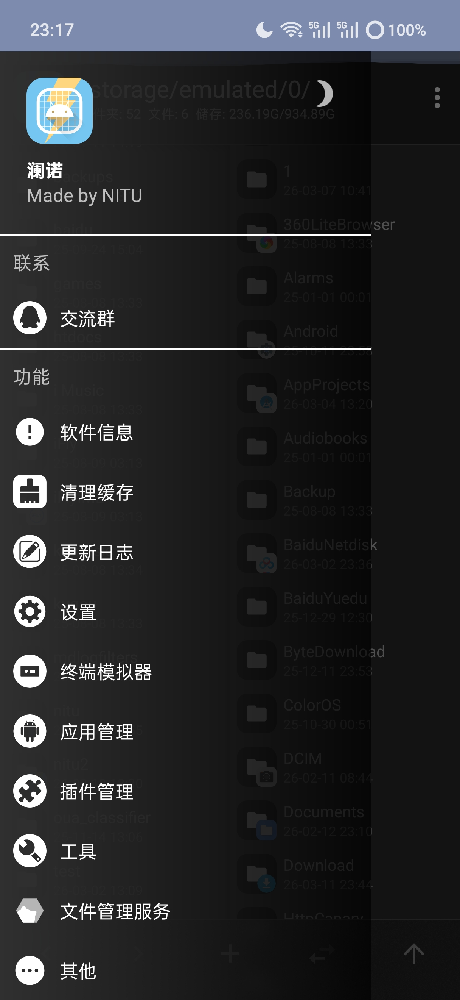

# NaroX: 一个Android多功能工具集

---
## 关于项目
这个项目一开始是我给自己练手的，顺便做一些对自己有用的功能

## 目前有的功能
- 文件管理器(类似mt管理器的双列模式，方便文件操作)
- 字符串操作(加密解密、哈希处理等功能)
- 实用工具(进制转换、预览网页、汇编转换等功能)
- 图片工具(转换图片到像素画等)
- Minecraft工具(查询史莱姆区块、玩家信息等)
- Minecraft存档解析与NBT编辑器
- 图片格式转换(png、jpg、svg等)
- 压缩包查看与解压
- 文件解析与修改(apk、AXml、elf等)
- 支持Shizuku与root功能
- 终端模拟器
- 插件功能
- ...

项目还在持续开发中，未来会有更多功能！

### QQ群:
点击 加入QQ群

