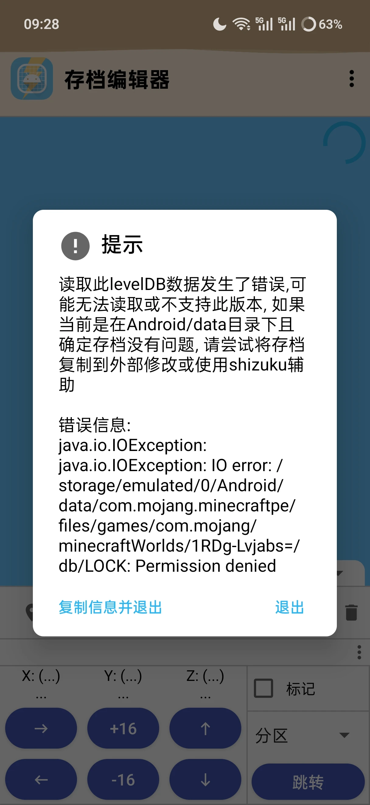
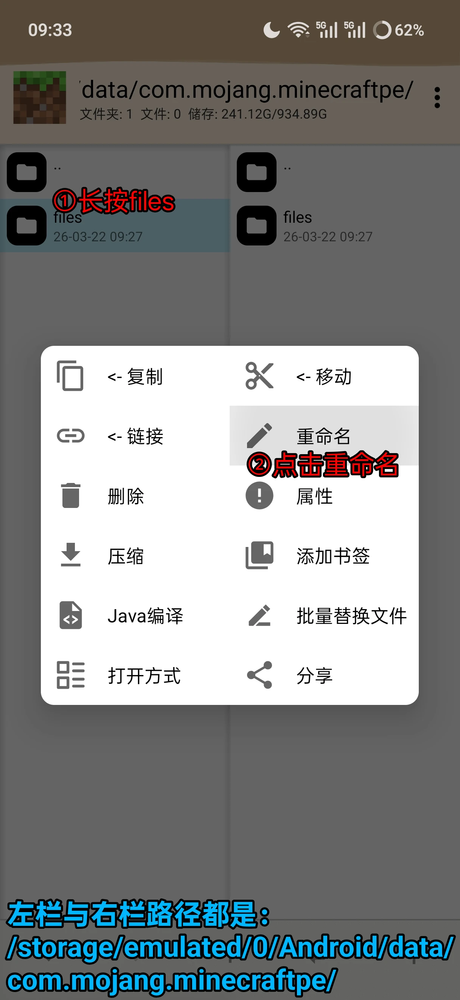
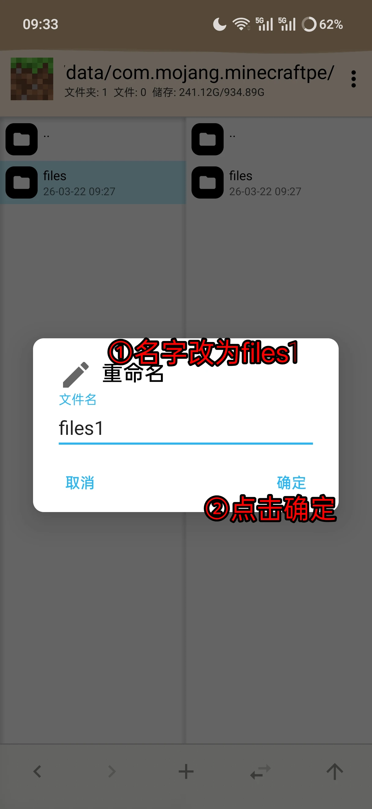
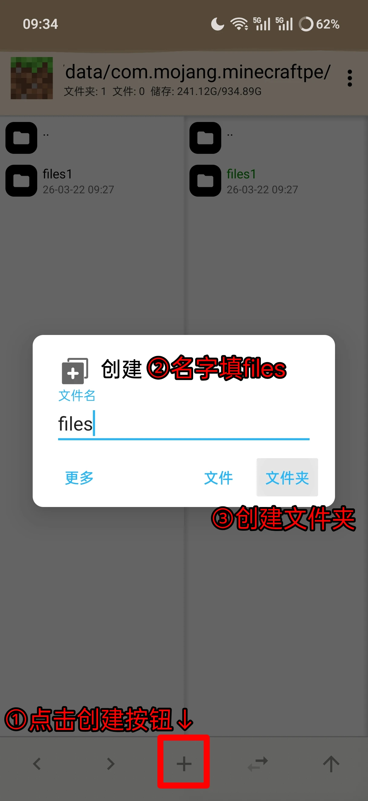
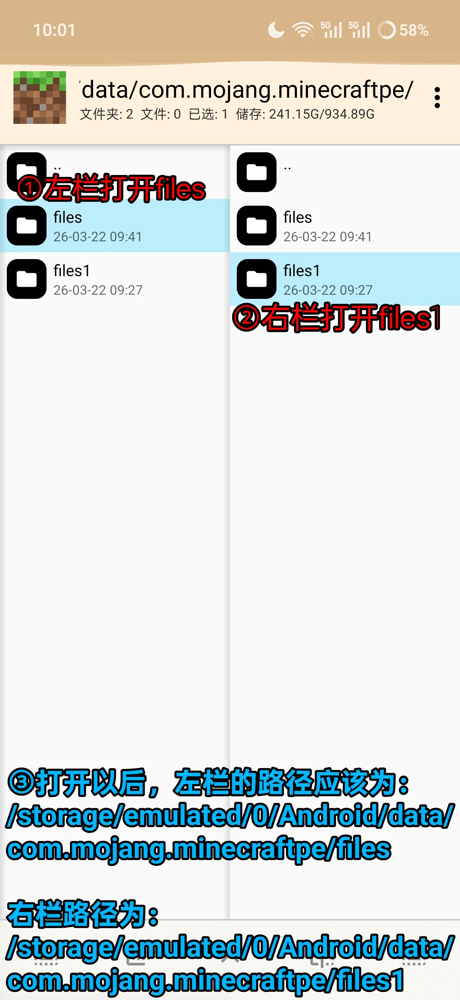
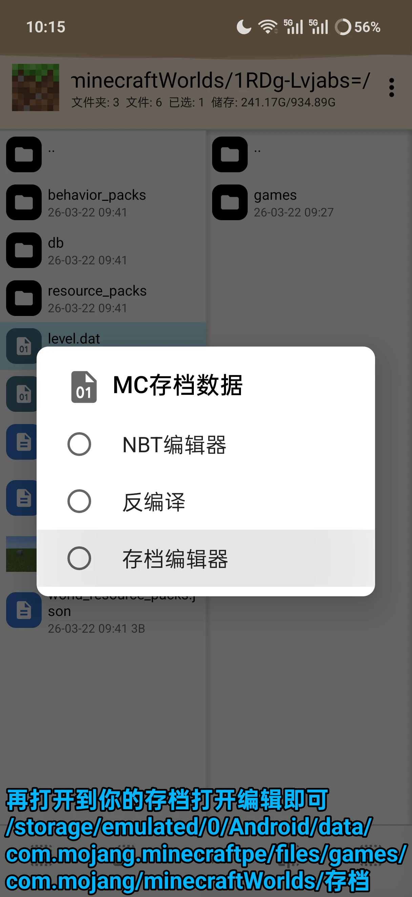

# 错误信息为【***Permission Denied***】



---
#### 步骤一

```text
左栏与右栏都打开到路径
【/storage/emulated/0/Android/data/com.mojang.minecraftpe】，
其中后面的【com.mojang.minecraftpe】是你的MC的包名，请替换为你对应的包名，例如官方中国版包名为【com.netease.x19】

```
>里面有一个【**files**】文件夹，长按【***左栏***】里面的【**files**】文件夹，然后点击重命名



---
#### 步骤二

>将 **files**】重命名成【**files1**】，点击确定



---
#### 步骤三

>点击下方 【**+**】创建文件夹，文件名填写【**files**】，点击确定



---
#### 步骤四

>【***左栏***】打开【**files**】，【***右栏***】打开【**files1**】，此时路径位置应为图示蓝色文字



---
#### 步骤五

>全选【***右栏***】所有文件（演示处只有games，如果你有其他文件夹，也要选上），长按并选择【**复制**】，将【**files1**】里面的内容复制到【**files**】内

![步骤五(6.webp)

---
#### 步骤六

>现在打开到你的【**files**】里面的存档位置，点击【**level.dat**】打开存档编辑器看看效果


